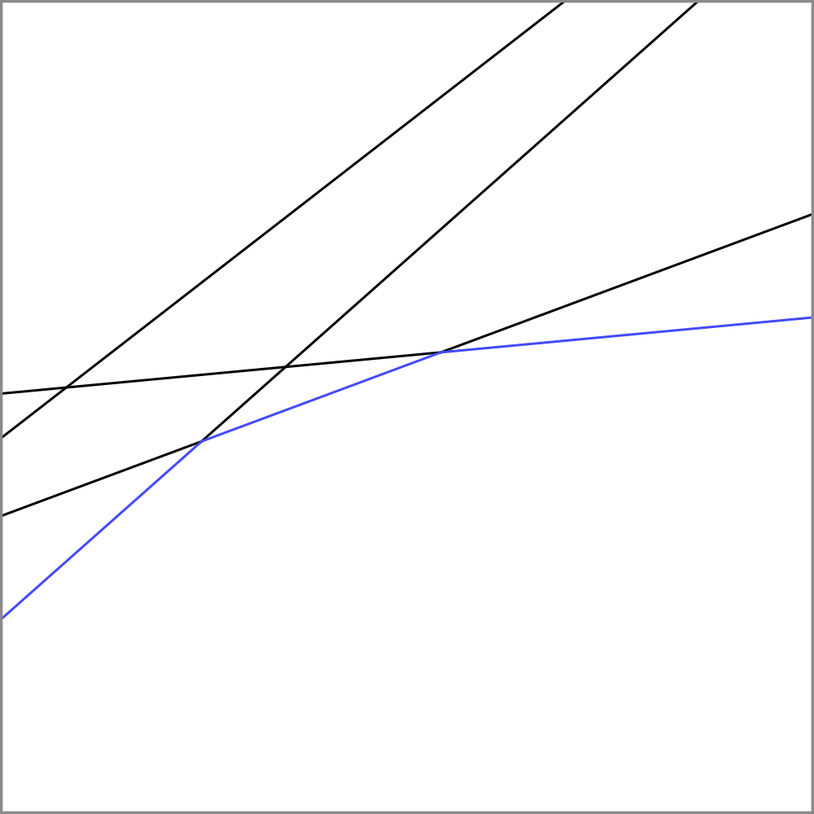

# Трюк выпуклой оболочки

Трюк выпуклой оболочки это метод оптимизации динамического программирования. В кратце этот трюк помогает обрабатывать 2 типа запросов:
1. Добавить новую линию $y=k*x+b$ в множество.
2. Дается $x$ и надо найти такую линию, что значение $k*x+b$ минимально либо максимально.

Будем считать что нам нужна выпуклая оболочка для подсчета минимального ответа а также что линии из первого запроса даются в порядке убывания $k$ и $x$ из второго запроса даются в порядке увеличения.

Создадим структуру $line$ для того чтобы хранить линии.
```cpp
struct line
{
	double k, b;
	double get(int x)
	{
		return k * x + b;
	}
};
```

Функция $get(x)$ возвращает значение $y$ для данного $x$.

Если у нас есть всего одна линия $y = k * x + b$. То эта линия будет оптимальной для любого $x$.

Если у нас есть 2 линии $y_1 = k_1 * x_1 + b$ и $y_2 = k_2 * x + b_2$, а также $k_1 > k_2$. В этом случае для одних x оптимальной будет первая линия, а для остальных вторая. Но как понять где какая линия лучше? Так как эти линии имеют различный угол наклона, то они должны пересечься. Найдем значение $x$ при котором эти линии пересекутся и назовем его $px$, то есть $k_1 * px + b_1 = k_2 * px + b_2$. Получаем $k_1 * px - k_2 * px = b_2 - b_1$, если вынести $px$ наружу, то получим $px * (k_1 - k_2) = b_2 - b_1$. Оставив слева только $px$ получим $px = \dfrac{k_1 - k_2}{b_2 - b_1}$. Теперь ответ будет следующим:
1. Для $x < px$ лучшим ответом будет первая линия
2. Для $x = px$ подойдет любая линия из двух.
3. Для $x > px$ лучшим ответом будет вторая линия.

Заведем стэк который будет хранить только те линии, которые являются оптимальными хоть для каких-то $x$. Остальные линии будут удалены. Хранить эти линии будем в порядке убывания угла, то есть $k$. Тогда на вершине стэка будет линия с самым минимальным $k$, а на дне стэка будет линия с максимальным $k$.

Предположим что нам надо добавить новую линию в множество. Так как значение $k$ у нее меньше чем у всех предыдущих, то эта линия будет лучше всех остальных для очень больших $x$. Тогда нам необходимо добавить ее в стэк. Но при этом какие-то другие линии из стэка могли стать бесполезными и нам надо их удалить. К счастью все линии которые нам надо удалить будут находиться на верхушке стэка. Будем удалять их до тех пор пока это необходимо, затем добавим нашу новую линию в стэк.
```cpp
cin >> k >> b;
new_line = line(k, b);
while(sz > 1 && (new_line.b - st[sz - 1].b) * (st[sz - 1].k - st[sz].k) <= (st[sz].b - st[sz - 1].b) * (st[sz - 1].k - new_line.k))
	sz--;
st[++sz] = new_line;
r = min(r, sz);
```



Теперь чтобы найти лучшую линию для определенного $x$ заметим следующее. Заведем функцию $\verb|best_line|(x)$ которая возвращает позицию линии в стэке которая дает оптимальный ответ для этого $x$. Тогда заметим что $\verb|best_line|(x) \le \verb|best_line|(x + 1)$, то есть чем больше $x$ тем выше в стэке будет находиться лучшая для него линия. Если $x$ из второго типа запроса даются в случайном порядке, тогда мы можем сделать бинарный поиск по стэку и найти лучшую линию. А если $x$ даются в порядке возрастания, то мы можем завести переменную $r$ которая хранит позицию самой оптимальной линии для $x$ из последнего запроса второго типа. Изначально когда у нас нет линий в стэке $r$ будет равно $0$. Теперь когда нас просят найти ответ для нового $x$ будем пытаться увеличивать $r$ пока ответ улучшается.
```cpp
while (r < sz && st[r].get(x) >= st[r + 1].get(x))
	r++;
cout << st[r].get(x) << "\n";
```

В итоге методом амортизационного анализа получаем что запросы первого и второго типа работают за $O(1)$.

Видео:
1. [Лекция от Станкевича](https://www.youtube.com/watch?v=ou0phsO_cLo)

Задачи:
1. [Land acquisition](https://vjudge.net/problem/SPOJ-ACQUIRE)

<script type="text/x-mathjax-config">
    MathJax.Hub.Config({
      tex2jax: {
        skipTags: ['script', 'noscript', 'style', 'textarea', 'pre'],
        inlineMath: [['$','$']]
      }
    });
  </script>
